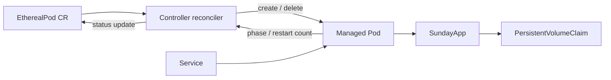

# Architecture and design decisions

## Problem framing

The assignment has two related guarantees:

1. An `EtherealPod` must continuously converge toward one active managed Pod
   and expose that Pod's restart count.
2. SundayApp must keep its grocery data when that Pod crashes or is replaced.

The design prioritizes observable correctness, a short setup path, and failure
behavior that can be demonstrated in a disposable Kubernetes cluster. It is
deliberately smaller than a production platform: every added dependency or
abstraction must solve a requirement that is present in the assignment.

I started by separating a container crash from a Pod failure. They look similar
from the application's point of view, but Kubernetes handles them at different
levels: the kubelet restarts containers, and the custom controller reconciles
Pods. The part that needed the most care was the phrase “exactly one.” I treat
it as a convergence guarantee and make the transition periods visible instead
of claiming that a distributed system can replace a Pod instantaneously.

## Invariants and failure semantics

- Ownership, not labels, defines which Pods belong to an EtherealPod. Labels
  remain useful for Services and operators, but changing a label cannot make
  the controller create an accidental duplicate.
- Reconciliation keeps one non-terminal, non-deleting Pod. If duplicates are
  observed, a Running Pod is preferred; ties are resolved by age and name so
  cleanup is deterministic.
- A container exit is recovered by the kubelet because the controller enforces
  `restartPolicy: Always`. This preserves the Pod identity and increments the
  Kubernetes restart counter.
- A deleted, evicted, Failed, or Succeeded Pod is replaced by the controller
  only after all old managed Pods disappear, including terminating Pods.
- A hash of `spec.template` triggers serial replacement when the template
  changes. Deletion completes before creation; a stuck finalizer blocks rollout.
- Ownership labels use bounded values for long resource names, while an
  annotation retains the full name. Owner references remain authoritative.
- The status is eventually consistent with the current Pod. `RESTARTS` is the
  sum of init- and application-container restart counts for that Pod, including
  an explicit zero. Ready conditions track the observed resource generation.
- Data belongs to a PVC rather than the Pod filesystem. Replacement therefore
  changes compute identity without changing data identity.

“Exactly one running Pod” is a convergence property rather than an
instantaneous distributed-system guarantee. Immediately after deletion there
must be a short zero-Pod interval while Kubernetes schedules the replacement.
During duplicate cleanup there may be a terminating Pod alongside its keeper.
The controller minimizes those intervals and never intentionally keeps two
active Pods.

## Technology choices and tradeoffs

### Go

I chose Go because Kubernetes clients and controller-runtime are native Go
libraries, both executables can be statically linked, and the standard library
is sufficient for the HTTP service. The tradeoff is more explicit error and
lifecycle code than a higher-level application framework, but that explicitness
makes failure paths visible and testable.

### controller-runtime instead of raw client-go

controller-runtime provides reconciliation, owned-resource watches, cached
clients, health probes, and leader election. Reimplementing those mechanics
with raw client-go would add code without improving the assignment's core
logic. The cost is a larger dependency graph; versions are pinned and scanned
with `govulncheck` to manage that cost.

### A direct Pod instead of Deployment and ReplicaSet children

I deliberately made the custom resource own one Pod directly. This gives a
clear one-to-one relationship for restart reporting and makes deletion recovery
part of the custom controller being evaluated. A Deployment would be a natural
production tool, but here it would delegate most of Part A to an existing
controller and make “the managed Pod” less direct because the ownership chain
includes a ReplicaSet.

### PodTemplateSpec as the custom-resource input

Reusing Kubernetes `PodTemplateSpec` makes container, probe, security-context,
resource, and volume configuration familiar to users. A smaller custom schema
would be easier to validate but would unnecessarily invent another Pod API.
The controller enforces restart policy and reserves its ownership labels and
annotations, including the template hash used to detect changes.

### Flat packages with narrow boundaries

I kept the package structure flat on purpose: composition roots live under
`cmd/`, and focused implementation packages live under `internal/`. A narrow
`GroceryStore` interface separates HTTP handling from persistence. A full
clean-architecture or DDD hierarchy would add ceremony to two small binaries
without creating another useful domain boundary.

### Atomic JSON on a PVC instead of a database

For this scope I chose atomic JSON on a PVC. The assignment needs durable data
for one SundayApp Pod, not multi-replica transactions, and a nested
`user -> product -> amount` map matches the requested model directly. Each
mutation clones the state, writes a temporary file, flushes it, atomically
renames it, and syncs the directory before acknowledging success. Rename is the
commit point: if the subsequent directory sync fails, memory still adopts the
new file contents and further writes are blocked until the store is reopened.
The client receives `500` with an uncertain outcome and should inspect the
stored value before retrying an increment. Failures before rename preserve the
old file and memory, and allow another write attempt.

The process acquires a nonblocking exclusive `flock` on a stable sidecar file
before reading data and keeps it until shutdown. The lock file is never removed:
removing its inode could let a second process acquire a different lock. This
requires Linux/macOS and reliable filesystem locking; RWO alone does not exclude
multiple Pods on the same node. Empty, malformed, or invalid existing data files
fail startup rather than silently discarding grocery data.

This avoids an external database and CGO while protecting the previous file
from partial writes. The tradeoffs are intentional:

- writes are serialized by a mutex;
- product totals and deletions scan all users;
- a lifetime process lock and mutex enforce one writer on a supported filesystem;
- a large dataset would eventually justify SQLite or a managed database.

### Standard-library HTTP server

I stayed with Go 1.26's method-aware `http.ServeMux` because it covers the three
required routes and a web framework would add little value here. The server has
header/read/write/idle timeouts, a 1 MiB request body limit, structured request
logging, and graceful SIGINT/SIGTERM shutdown. JSON, query, and form input are
accepted for POST because the assignment specifies parameters but not their
wire encoding. JSON is authoritative when selected; form values override query
values. Invalid encodings and null JSON fail before storage is called. Unsupported
content types return `415`, malformed input `400`, and oversized bodies `413`.

## Operational choices

- The controller runs two replicas with leader election. A standby can acquire
  leadership if the active controller Pod disappears.
- Both runtime containers are non-root, drop Linux capabilities, use a
  read-only root filesystem, and declare CPU/memory requests and limits.
- Readiness and liveness probes separate process health from Service traffic.
- RBAC grants only the CRD, status, Pod, and lease operations required by the
  controller.
- `requirements.sh` is repeatable: it refreshes fixed development image tags,
  waits for CRD discovery, and proves the application replacement is Ready.

## Implementation strategy

The work can be reasoned about in five checkpoints:

1. Define CRD schema, status, printer columns, and ownership invariants.
2. Implement reconciliation and unit-test creation, deletion, terminal Pods,
   duplicates, readiness, and restart aggregation.
3. Implement the storage boundary first, then add validated HTTP handlers and
   graceful process lifecycle around it.
4. Package both binaries as non-root images and wire CRD, RBAC, controller,
   PVC, Service, and EtherealPod manifests.
5. Verify ordinary behavior with unit/race/lint/security checks, then verify
   failure behavior in kind by deleting a Pod and crashing a container.

This order reduces debugging scope: storage and reconciliation behavior are
validated before Docker or Kubernetes is involved.

## Testing strategy

- Store tests cover reload, deletion, concurrent writes, integer overflow,
  interprocess exclusion, corrupt files, and failures before/after rename.
- HTTP tests cover successful methods, validation, malformed input, and body
  limits.
- Controller tests cover initial creation, deletion recovery, terminal-Pod
  replacement, termination waits, template rollouts, long names, duplicate cleanup,
  readiness, observed generation, and explicit zero restart status.
- Server tests verify fatal listen errors, graceful shutdown, request metrics,
  and goroutine leaks.
- `go test -race`, `go vet`, golangci-lint, and `govulncheck` are CI gates.
- `e2e/e2e.sh` writes data, deletes the application Pod, reads the data through
  its replacement, rolls out a changed template and checks persistence again,
  then creates a crashing EtherealPod and waits for `RESTARTS` to increase.
  HTTP clients stop waiting on either successful or failed completion; only the
  initial cleanup explicitly accepts an HTTP `404`.

## Known limits and production evolution

The JSON store is the clearest time-boxed choice in this solution. I would not
stretch it to multiple application replicas: that would change the consistency
model and call for a database rather than more locking around one file. Serial
rollouts deliberately trade availability for writer exclusion. A force-deleted
Pod can leave a running process behind, so normal deletion and reliable volume
locking remain operational requirements.

The remaining production steps I would discuss are:

- expose reconciliation and HTTP metrics through Prometheus/OpenTelemetry;
- add authentication, authorization, TLS termination, and rate limiting;
- use a database when multiple writers, queries, backups, or large datasets
  are required;
- add admission validation for policies beyond the CRD's structural schema;
- exercise multi-node volume failure and controller upgrades in a persistent
  integration environment rather than only kind.
